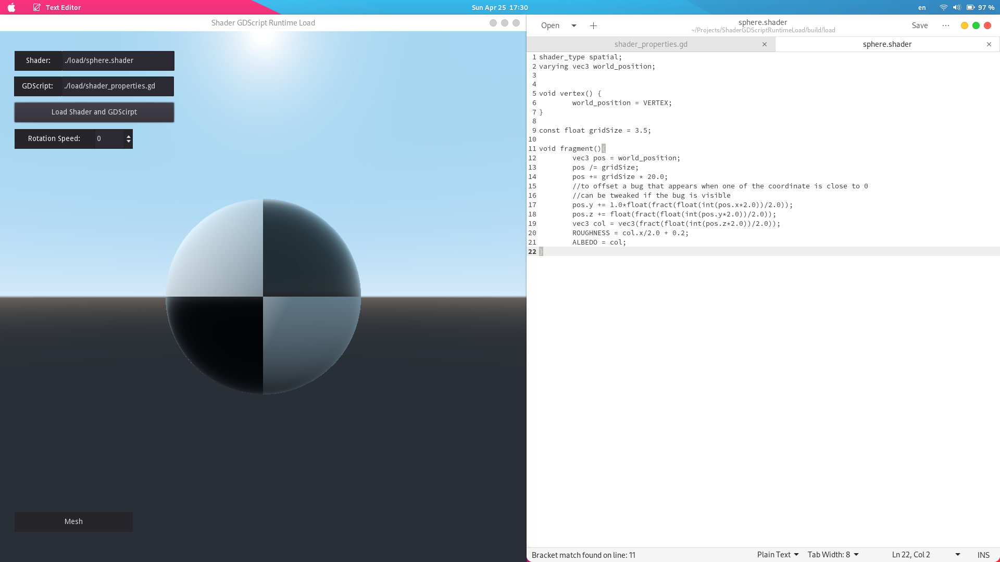
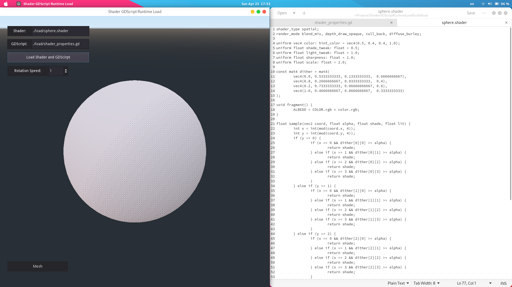
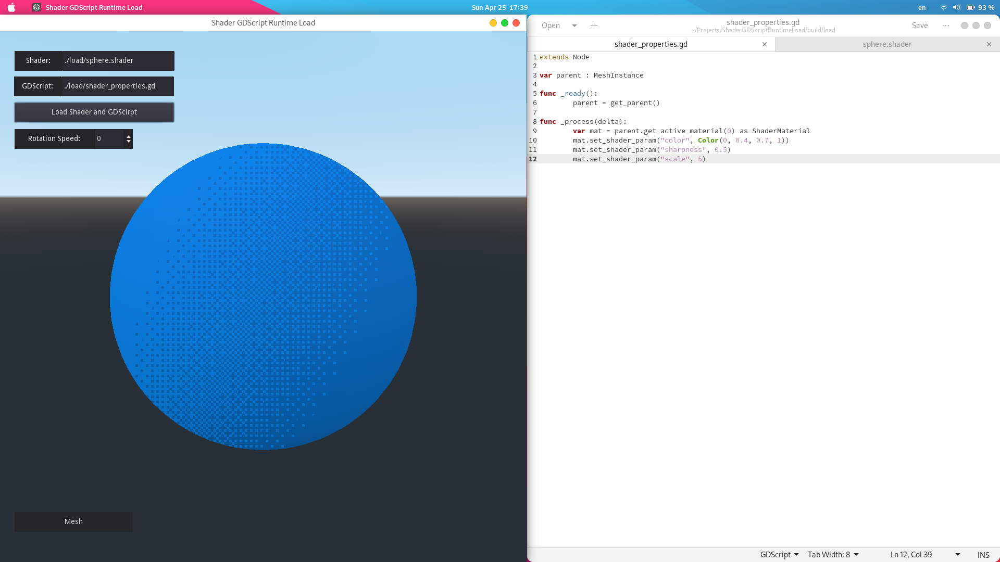
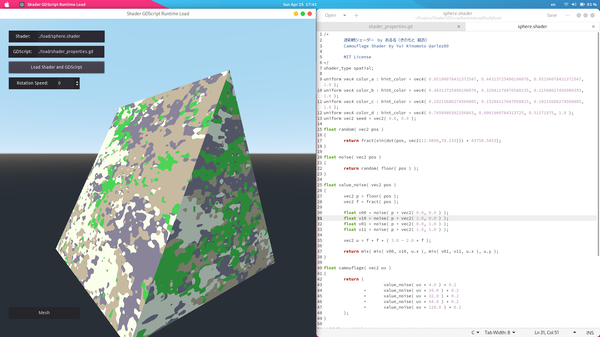
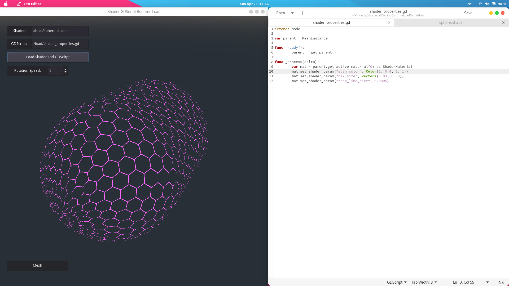
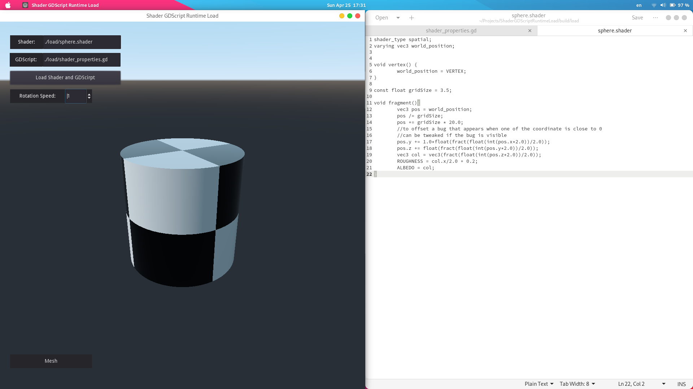
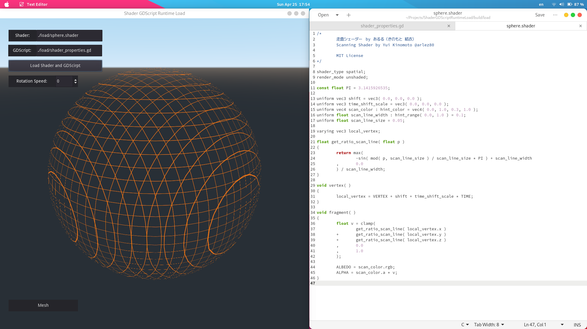

# Runtime_Godot_shader_loader
### Little Godot 3.3 project for playing with shaders
### You can change then load GDScript and Godot shader source at runtime. Aply them to the primitive shapes.

Write any GDScript code you need to do it look beautiful: load textures, generate noise, change uniforms, change them over time ...
> Can any other game engine do this? It's amazing! I'm very happy with this:)

## Some screenshots:
Shaders from site https://godotshaders.com/

Yeaa, I'm lazy to white any complex shader, may be later)))

GDSript is childe node relative to this MeshInstance, so you need to change uniforms of parent object

This is cool tent))

This one changes over time. Gif needed :) 

